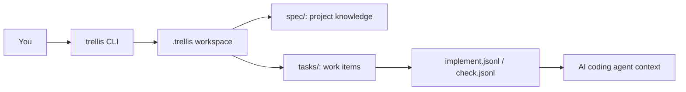
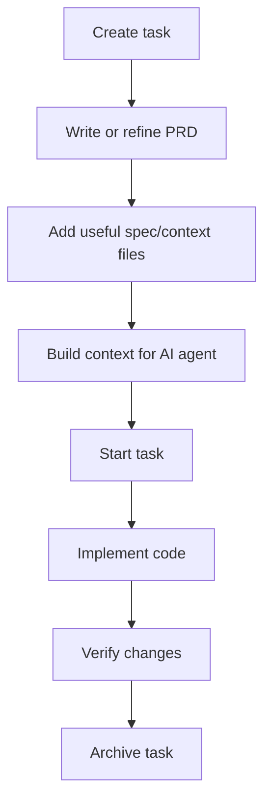
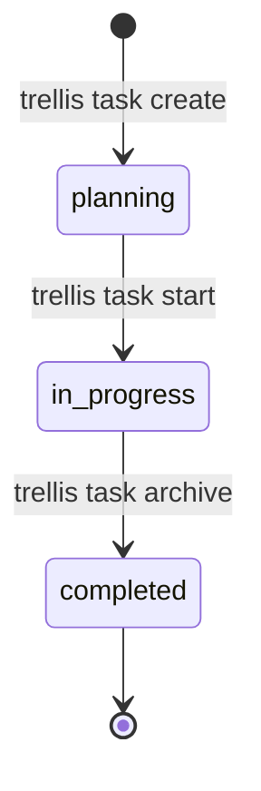

# Trellis User Guide

This guide explains Trellis from zero. If you can use a terminal, Git, and a code editor, you can follow it.

> 中文版：[`USAGE.zh-CN.md`](USAGE.zh-CN.md)

## 1. What is Trellis?

Trellis is a small command-line tool for AI-assisted software projects. It creates a `.trellis/` folder inside your Git repository and stores:

- **Specs**: reusable engineering rules and background knowledge.
- **Tasks**: one folder per piece of work, with status and requirement files.
- **Context manifests**: lists of files that should be injected into an AI coding session.
- **Workflow state**: a simple Plan → Implement → Verify → Finish engineering process.

In plain English: Trellis helps you avoid repeatedly explaining the same project rules to every AI coding agent.

## 2. Mental Model

Think of Trellis as a project notebook that lives with your code.



### Important folders

```text
your-project/
├── .git/
├── .trellis/
│   ├── config.yaml
│   ├── workflow.md
│   ├── spec/
│   ├── tasks/
│   │   ├── 06-14-user-auth/
│   │   │   ├── task.json
│   │   │   ├── prd.md
│   │   │   ├── implement.jsonl
│   │   │   ├── check.jsonl
│   │   │   └── research/
│   │   └── archive/
│   └── workspace/
└── your source code...
```

## 3. Install

### Requirements

- Go 1.23 or newer
- Git
- A terminal

### Install with Go

```bash
go install github.com/superops-team/trellis-go/cmd/trellis@latest
```

Check that it works:

```bash
trellis version
```

If your shell says `trellis: command not found`, make sure Go's binary directory is in `PATH`:

```bash
go env GOPATH
```

Then add `$GOPATH/bin` to your shell `PATH`.

## 4. Start a New Project

Trellis must be initialized inside a Git repository.

```bash
mkdir my-project
cd my-project
git init
trellis init --developer alice
```

Use your own name instead of `alice`.

### Initialize for multiple AI platforms

```bash
trellis init --developer alice --platform claude --platform cursor --platform codex
```

### Initialize all supported platforms

```bash
trellis init --developer alice --all
```

## 5. Daily Workflow

Most users only need this loop:



### Step 1: Create a task

```bash
trellis task create user-auth
```

This creates a folder like:

```text
.trellis/tasks/06-14-user-auth/
```

Inside it:

- `task.json`: task ID, name, status, timestamps.
- `prd.md`: write requirements here.
- `implement.jsonl`: files needed during implementation.
- `check.jsonl`: files needed during verification.
- `research/`: optional research notes.

### Step 2: List tasks

```bash
trellis task list
```

Only active tasks are shown. Archived tasks are hidden.

### Step 3: Write the PRD

Open the task's `prd.md` and write what you want to build.

Example:

```markdown
# PRD: User Authentication

Build JWT-based login.

## Requirements
- Users can log in with email and password.
- The server returns an access token.
- Invalid credentials return a clear error.
```

### Step 4: Add context files

Context files must be referenced relative to `.trellis/`.

For example, create a spec file:

```bash
mkdir -p .trellis/spec/auth/api
cat > .trellis/spec/auth/api/index.md <<'EOF'
# Auth API Spec

Use JWT access tokens. Never log passwords or tokens.
EOF
```

Add it to the implementation context:

```bash
trellis context add spec/auth/api/index.md \
  --task user-auth \
  --phase implement \
  --required \
  --description "Auth API spec"
```

Meaning of flags:

| Flag | Meaning |
| --- | --- |
| `--task user-auth` | Which task receives the context entry. |
| `--phase implement` | Add this file to `implement.jsonl`. Use `check` for verification context. |
| `--required` | Fail context building if the file is missing. |
| `--description` | Human-readable note explaining why this file matters. |

Safety rule: Trellis rejects absolute paths and `..` paths, so context cannot point outside the Trellis workspace.

### Step 5: Build context

For implementation:

```bash
trellis context build --task user-auth --phase implement
```

For verification:

```bash
trellis context build --task user-auth --phase check
```

For general research/spec discovery, no task is required:

```bash
trellis context build --phase research
```

The output includes a marker:

```html
<!-- trellis-hook-injected -->
```

You can paste or pipe the output into your AI coding tool.

### Step 6: Start the task

```bash
trellis task start user-auth
```

This changes the task status from `planning` to `in_progress`.

### Step 7: Archive the task

After finishing and verifying the work:

```bash
trellis task archive user-auth
```

This changes the status to `completed` and moves the task under:

```text
.trellis/tasks/archive/YYYY-MM/
```

## 6. Task Lifecycle



Invalid transitions fail. For example, you cannot archive a task that has not been started.

## 7. Context Manifest Format

`implement.jsonl` and `check.jsonl` are JSON Lines files. Each line is one JSON object.

Example:

```jsonl
{"path":"spec/auth/api/index.md","description":"Auth API spec","required":true}
{"path":"spec/security/passwords.md","description":"Password handling rules","required":false}
```

Fields:

| Field | Type | Meaning |
| --- | --- | --- |
| `path` | string | File path relative to `.trellis/`. |
| `description` | string | Why this file is useful. |
| `required` | boolean | Whether missing file should fail context build. |

Use the CLI to append entries when possible; it validates paths for you.

## 8. Root Resolution

Most commands run from the repository root:

```bash
trellis task list
```

If you are outside the repo, use `--root`:

```bash
trellis --root /path/to/repo task list
```

You may also point directly at `.trellis`:

```bash
trellis --root /path/to/repo/.trellis task list
```

## 9. Uninstall

Remove Trellis completely:

```bash
trellis uninstall
```

Remove configs but keep task history:

```bash
trellis uninstall --keep-tasks
```

## 10. Beginner-Friendly Full Example

Copy and run this in an empty directory:

```bash
mkdir trellis-demo
cd trellis-demo
git init

trellis init --developer beginner --platform claude
trellis task create hello-ai

cat > .trellis/tasks/*-hello-ai/prd.md <<'EOF'
# PRD: Hello AI

Create a tiny feature and explain the change clearly.
EOF

mkdir -p .trellis/spec/demo
cat > .trellis/spec/demo/index.md <<'EOF'
# Demo Spec

Keep examples small and easy to understand.
EOF

trellis context add spec/demo/index.md --task hello-ai --phase implement --required --description "Demo spec"
trellis context build --task hello-ai --phase implement
trellis task start hello-ai
trellis task archive hello-ai
```

## 11. Troubleshooting

### `not a git repository; run 'git init' first`

Run:

```bash
git init
```

Then retry `trellis init`.

### `trellis already initialized`

The `.trellis/` folder already exists. Use the existing workspace, or remove it if you really want to start over.

### `task not found`

Check the exact task ID:

```bash
trellis task list
```

Use the printed ID with `task start`, `task archive`, or `context build`.

### `invalid task status transition`

You tried a lifecycle step in the wrong order. Use:

```text
create → start → archive
```

### `context path must be relative` or `context path cannot contain ..`

Use paths relative to `.trellis/`, such as:

```bash
trellis context add spec/auth/api/index.md --task user-auth --phase implement
```

Do not use `/absolute/path` or `../outside-file`.

### Required context file is missing

If a manifest entry has `required: true`, the file must exist. Create the file or remove the entry.

## 12. Command Reference

| Command | Purpose | Example |
| --- | --- | --- |
| `trellis init` | Create `.trellis/` in a Git repo. | `trellis init --developer alice` |
| `trellis task create <name>` | Create a task. | `trellis task create user-auth` |
| `trellis task list` | List active tasks. | `trellis task list` |
| `trellis task current` | Show current active task placeholder. | `trellis task current` |
| `trellis task start <id>` | Move task to `in_progress`. | `trellis task start user-auth` |
| `trellis task archive <id>` | Complete and archive task. | `trellis task archive user-auth` |
| `trellis context add <file>` | Add a file to a context manifest. | `trellis context add spec/auth.md --task user-auth --phase implement` |
| `trellis context build` | Print assembled context. | `trellis context build --task user-auth --phase implement` |
| `trellis uninstall` | Remove Trellis files. | `trellis uninstall --keep-tasks` |
| `trellis version` | Print version. | `trellis version` |

## 13. Developer Notes

Build from source:

```bash
go build -o trellis ./cmd/trellis
```

Run tests:

```bash
go test ./...
go test -cover ./pkg/...
```

