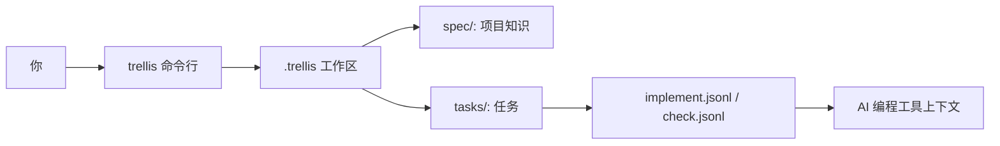
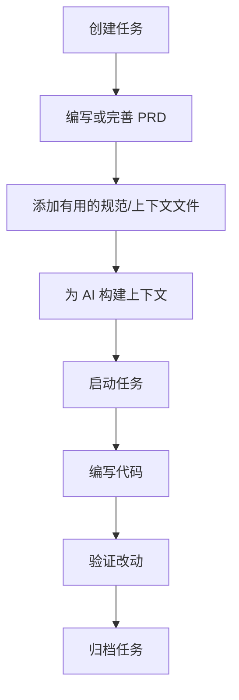
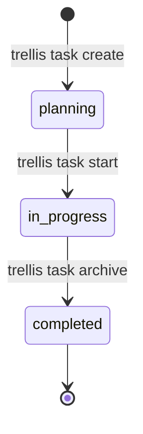

# Trellis 使用指南

这份文档面向第一次接触 Trellis 的用户。只要你会打开终端、会用 Git、会编辑文件，就可以照着做。

> English version: [`USAGE.md`](USAGE.md)

## 1. Trellis 是什么？

Trellis 是一个面向 AI 编程项目的小型命令行工具。它会在你的 Git 仓库里创建 `.trellis/` 目录，用来保存：

- **规范（Specs）**：项目长期有效的工程规则、背景知识、约束。
- **任务（Tasks）**：每个需求或修复都有一个任务目录，里面有状态和需求文件。
- **上下文清单（Context manifests）**：告诉 AI 编程工具应该读取哪些文件。
- **工作流状态（Workflow state）**：Plan → Implement → Verify → Finish 四阶段流程。

通俗地说：Trellis 帮你把“每次都要重复告诉 AI 的项目规则”沉淀到仓库里。

## 2. 先建立一个心智模型

你可以把 Trellis 理解成“跟着代码一起走的项目笔记本”。



### 重要目录

```text
your-project/
├── .git/
├── .trellis/
│   ├── config.yaml
│   ├── workflow.md
│   ├── spec/
│   ├── tasks/
│   │   ├── 06-14-user-auth/
│   │   │   ├── task.json
│   │   │   ├── prd.md
│   │   │   ├── implement.jsonl
│   │   │   ├── check.jsonl
│   │   │   └── research/
│   │   └── archive/
│   └── workspace/
└── 你的源代码...
```

## 3. 安装

### 前置条件

- Go 1.23 或更高版本
- Git
- 终端

### 使用 Go 安装

```bash
go install github.com/superops-team/trellis-go/cmd/trellis@latest
```

检查是否安装成功：

```bash
trellis version
```

如果提示 `trellis: command not found`，说明 Go 的可执行文件目录没有加入 `PATH`。先查看：

```bash
go env GOPATH
```

然后把 `$GOPATH/bin` 加入你的 shell `PATH`。

## 4. 初始化一个项目

Trellis 必须在 Git 仓库里初始化。

```bash
mkdir my-project
cd my-project
git init
trellis init --developer alice
```

把 `alice` 换成你的名字即可。

### 初始化多个 AI 平台

```bash
trellis init --developer alice --platform claude --platform cursor --platform codex
```

### 初始化所有支持的平台

```bash
trellis init --developer alice --all
```

## 5. 日常使用流程

大多数用户只需要记住这条主线：



### 第 1 步：创建任务

```bash
trellis task create user-auth
```

它会创建类似这样的目录：

```text
.trellis/tasks/06-14-user-auth/
```

里面包含：

- `task.json`：任务 ID、名称、状态、时间戳。
- `prd.md`：在这里写需求。
- `implement.jsonl`：实现阶段需要给 AI 的文件列表。
- `check.jsonl`：验证阶段需要给 AI 的文件列表。
- `research/`：可选的调研笔记。

### 第 2 步：查看任务列表

```bash
trellis task list
```

这里只会显示活跃任务。已经归档的任务不会显示。

### 第 3 步：编写 PRD

打开任务目录下的 `prd.md`，写清楚你要做什么。

示例：

```markdown
# PRD: 用户登录

实现基于 JWT 的登录能力。

## 需求
- 用户可以使用邮箱和密码登录。
- 服务端返回 access token。
- 密码错误时返回清晰的错误信息。
```

### 第 4 步：添加上下文文件

上下文文件路径必须相对于 `.trellis/`。

例如先创建一个规范文件：

```bash
mkdir -p .trellis/spec/auth/api
cat > .trellis/spec/auth/api/index.md <<'EOF'
# Auth API Spec

Use JWT access tokens. Never log passwords or tokens.
EOF
```

把它加入实现阶段上下文：

```bash
trellis context add spec/auth/api/index.md \
  --task user-auth \
  --phase implement \
  --required \
  --description "Auth API spec"
```

参数解释：

| 参数 | 含义 |
| --- | --- |
| `--task user-auth` | 把上下文加入哪个任务。 |
| `--phase implement` | 加到 `implement.jsonl`。如果是验证阶段，使用 `check`。 |
| `--required` | 如果文件不存在，构建上下文时直接报错。 |
| `--description` | 给人看的说明，解释为什么需要这个文件。 |

安全规则：Trellis 会拒绝绝对路径和包含 `..` 的路径，避免上下文引用到 Trellis 工作区之外的文件。

### 第 5 步：构建上下文

实现阶段：

```bash
trellis context build --task user-auth --phase implement
```

验证阶段：

```bash
trellis context build --task user-auth --phase check
```

调研/查看规范索引时，不需要指定任务：

```bash
trellis context build --phase research
```

输出里会包含标记：

```html
<!-- trellis-hook-injected -->
```

你可以把输出复制给 AI 编程工具，或者通过管道传给其它命令。

### 第 6 步：启动任务

```bash
trellis task start user-auth
```

这会把任务状态从 `planning` 改为 `in_progress`。

### 第 7 步：归档任务

完成并验证之后：

```bash
trellis task archive user-auth
```

这会把任务状态改为 `completed`，并移动到：

```text
.trellis/tasks/archive/YYYY-MM/
```

## 6. 任务生命周期



错误顺序会失败。例如：任务还没启动就不能归档。

## 7. 上下文清单格式

`implement.jsonl` 和 `check.jsonl` 是 JSON Lines 文件。每一行都是一个 JSON 对象。

示例：

```jsonl
{"path":"spec/auth/api/index.md","description":"Auth API spec","required":true}
{"path":"spec/security/passwords.md","description":"Password handling rules","required":false}
```

字段说明：

| 字段 | 类型 | 含义 |
| --- | --- | --- |
| `path` | string | 相对于 `.trellis/` 的文件路径。 |
| `description` | string | 这个文件为什么有用。 |
| `required` | boolean | 文件缺失时是否让构建上下文失败。 |

建议优先用 CLI 添加条目，因为 CLI 会帮你校验路径。

## 8. 根路径解析

大多数情况下，在仓库根目录执行命令即可：

```bash
trellis task list
```

如果你不在仓库目录里，可以用 `--root`：

```bash
trellis --root /path/to/repo task list
```

也可以直接指向 `.trellis`：

```bash
trellis --root /path/to/repo/.trellis task list
```

## 9. 卸载

完全移除 Trellis：

```bash
trellis uninstall
```

移除配置，但保留任务历史：

```bash
trellis uninstall --keep-tasks
```

## 10. 小白完整示例

在一个空目录里复制并运行：

```bash
mkdir trellis-demo
cd trellis-demo
git init

trellis init --developer beginner --platform claude
trellis task create hello-ai

cat > .trellis/tasks/*-hello-ai/prd.md <<'EOF'
# PRD: Hello AI

Create a tiny feature and explain the change clearly.
EOF

mkdir -p .trellis/spec/demo
cat > .trellis/spec/demo/index.md <<'EOF'
# Demo Spec

Keep examples small and easy to understand.
EOF

trellis context add spec/demo/index.md --task hello-ai --phase implement --required --description "Demo spec"
trellis context build --task hello-ai --phase implement
trellis task start hello-ai
trellis task archive hello-ai
```

## 11. 常见问题

### `not a git repository; run 'git init' first`

先执行：

```bash
git init
```

再重新运行 `trellis init`。

### `trellis already initialized`

说明 `.trellis/` 已经存在。你可以继续使用当前工作区；如果确实要重来，可以先删除 `.trellis/`。

### `task not found`

先查看准确任务 ID：

```bash
trellis task list
```

然后把输出的 ID 用在 `task start`、`task archive` 或 `context build`。

### `invalid task status transition`

任务生命周期顺序错了。正确顺序是：

```text
create → start → archive
```

### `context path must be relative` 或 `context path cannot contain ..`

请使用相对于 `.trellis/` 的路径，例如：

```bash
trellis context add spec/auth/api/index.md --task user-auth --phase implement
```

不要使用 `/absolute/path` 或 `../outside-file`。

### Required context file is missing

如果清单条目里 `required: true`，对应文件必须存在。创建文件，或者删除该条目。

## 12. 命令速查

| 命令 | 用途 | 示例 |
| --- | --- | --- |
| `trellis init` | 在 Git 仓库里创建 `.trellis/`。 | `trellis init --developer alice` |
| `trellis task create <name>` | 创建任务。 | `trellis task create user-auth` |
| `trellis task list` | 查看活跃任务。 | `trellis task list` |
| `trellis task current` | 显示当前活跃任务占位信息。 | `trellis task current` |
| `trellis task start <id>` | 把任务改为 `in_progress`。 | `trellis task start user-auth` |
| `trellis task archive <id>` | 完成并归档任务。 | `trellis task archive user-auth` |
| `trellis context add <file>` | 添加文件到上下文清单。 | `trellis context add spec/auth.md --task user-auth --phase implement` |
| `trellis context build` | 输出组装后的上下文。 | `trellis context build --task user-auth --phase implement` |
| `trellis uninstall` | 移除 Trellis 文件。 | `trellis uninstall --keep-tasks` |
| `trellis version` | 查看版本。 | `trellis version` |

## 13. 开发者补充

从源码构建：

```bash
go build -o trellis ./cmd/trellis
```

运行测试：

```bash
go test ./...
go test -cover ./pkg/...
```
